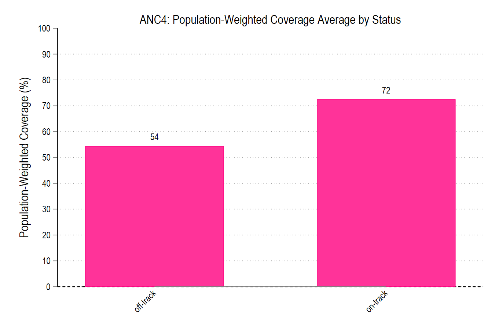

# Task 1: Population-Weighted Coverage for ANC and SBA for On-Track and Off-Track Countries

This analysis compares the population-weighted coverage of key maternal health indicators (ANC4 and SBA) between on-track and off-track countries.

## Overview

The analysis focuses on two main indicators:
- **ANC4:** Antenatal care coverage for at least four visits.
- **SBA:** Skilled birth attendance coverage.

## Graphs

### ANC4 Coverage

### SBA Coverage

## Interpretation

The above bar charts compare the population-weighted coverage estimates for on-track and off-track countries for each indicator - antenatal care coverage for 4 visits and skilled birth attendant coverage. On-track countries generally show higher coverage across both indicators compared to off-track countries, highlighting disparities in access to essential maternal health services. For ANC4, the population-weighted coverage for on-track vs off-track countries is 72.5% and 54.4%, respectively. Off-track countries have far fewer pregnant women attending ANC4, which impacts the necessary maternal health services they are receiving up until delivery and could also play a part in safe delivery and/or maternal or neonatal mortality. For SBA coverage, the population-weighted coverage is 92.2% for on-track countries and 63.8% for off-track countries. Higher SBA coverage in on-track countries suggests better preparedness to handle any potential complications during delivery, therefore, potentially reducing risk of maternal and neonatal mortality. Lower SBA coverage in off-track countries may suggest a shortage of trained skilled birth attendants and highlight gaps in healthcare delivery. Some potential caveats are that these population-weighted coverage estimates are averages and may not capture subnational inequities or variations within countries. These results also represent a snapshot in time and may not reflect any changes in coverage that may have occurred. We also used the projected births from 2022 rather than doing a by-year or annual comparison of population-weighted coverage estimates.

