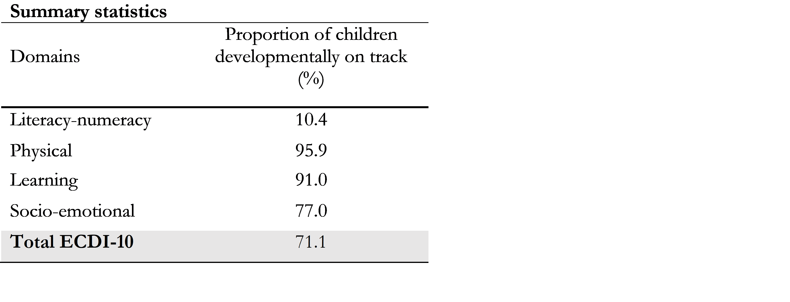

# Task 2: Data Perspective - Evolution of Education for 4- to 5-Year-Old Children

## Introduction

Early childhood development is multidimensional and encompasses several aspects of a child's well-being, including physical growth, literacy and numeracy skills, socio-emotional development and readiness to learn. These four domains are vital to a child’s overall development and build the foundation for later life, setting the trajectory for health, learning
and well-being. This current analysis seeks to better understand how educational performance among 4- to 5-year-old children in Zimbabwe evolves month by month at these critical ages. The following development domains were assessed by the child's age in months: Literacy & Math, Physical, Learning, and Socio-emotional. Data was utilized from the 2019 Zimbabwe MICS6 survey, focusing on children aged 3 and 4 years.

## Methodology

The analysis focuses on four key domains:
- **Literacy & Math** (EC6, EC7, EC8): Children are identified as being developmentally on track based on whether they can identify/name at least ten letters of the alphabet, whether they can read at least four simple, popular words, and whether they know the name and recognize the symbols of all numbers from 1 to 10. If at least two of these are true, then the child is considered developmentally on track.
- **Physical** (EC9, reverse-coded EC10): If the child can pick up a small object with two fingers, like a stick or a rock from the ground and/or the mother/caretaker does not indicate that the child is sometimes too sick to play, then the child is regarded as being developmentally on track in the physical domain.
- **Learning** (EC11, EC12): If the child follows simple directions on how to do something correctly and/or when given something to do, is able to do it independently, then the child is considered to be developmentally on track in this domain.
- **Socio-emotional** (EC13, reverse-coded EC14, reverse-coded EC15): Children are considered to be developmentally on track if two of the following are true: If the child gets along well with other children, if the child does not kick, bite, or hit other children and if the child does not get distracted easily.

Each domain was represented by a composite score, calculated by assessing whether children met the necessary criteria for each domain.
ECDI-10 is then calculated as the percentage of children who are developmentally on track in at least three of these four domains.

## Results

### Overall Analysis

The summary statistics shown in the table below offer a snapshot of how children in Zimbabwe are performing across all these domains, as well as the Early Childhood Development Index (ECDI-10).

Key findings include the following:
- Literacy & Math: children are performing the poorest for this domain, with only 10.4% on track. There is an urgent need for targeted educational and parent-focused interventions to support literacy and numeracy development in early childhood.
- Physical: children are performing the best in physical development, with 95.9% of children on track, which suggests that children are physically able to engage in appropriate activities for their age. This may also suggest that health and nutrition interventions in Zimbabwe are effective in promoting physical well-being.
- Learning: children are also performing well with regards to learning, with 91.0% on track in this domain, suggesting strong cognitive abilities that will set them up for success once they enter formal schooling.
- Socio-emotional: while a majority of children (77.0%) are on track for socio-emotional development, about 23% are being left behind with regards to social skills and emotional regulation. Efforts must be made to implement programs that may help these children catch up with their peers.

The overall ECDI-10 score shows that 71.1% of children in Zimbabwe are developmentally on-track across at least three out of four of the individual domains. About one-third of children in Zimbabwe may benefit from targeted interventions that will support them in achieving key developmental milestones.

### Analysis by Child's Age in Months

The analysis also sought to better understand how educational performance evolves month by month among children aged 4- to 5-years in Zimbabwe. Children under 5 years undergo rapid developmental changes, with this being a critical time for setting the child up for future success and well-being. A month-by-month analysis may help to highlight when key milestones are met and any critical times for potential interventions or programming. It is also important to note that children develop at different rates and by unveiling this variability through such an analysis, decision-makers are better able to tailor educational strategies and individualized approaches - especially related to specific domains of early childhood development.

The graph below shows the proportion of children who are developmentally on track by age of the child (in months) in each of the four domains. The overall ECDI-10 score is also shown to highlight the proportion of children who are on track for at least three out of the four domains by age of the child (in months). 

Notably, literacy and math skills are consistenly low across the 36 to 60 month age range; however, there is a jump in the proportion of children who are on track at month 49-50 and 56-59.

Both learning and physical development are consistently high from month-to-month, with values exceeding 90% for majority of months, especially for physical development.

Socio-emotional development is generally consistent across the entire age range, with an increase at month 41 and month 51, but a slight decrease from months 56-60. A lower proportion of children with socio-emotional development towards the higher age range could indicate potential challenges in managing social interactions and emotions as children age and complex social dynamics evolve.

The overall ECDI-10 score sees a large increase from months 36 to 41 in the proportion of children who are developmentally on track in at least three out of four domains. This may highlight the fact that a large proportion of children are catching up in multiple domains by month 41. However, subsequent fluctuations may highlight variability in progress among children, with some children developing at a more consistent rate than others. 

## Significance

This analysis has implications for early childhood development and education interventions and programming. The consistent low proportions of children on track for the literacy and math domain highlight a critical area where early educational interventions are necessary. Programming to improve literacy and math skills must be prioritized, especially as children approach school age and so that they do not fall behind. This analysis also highlights the need for support for socio-emotional development. It would be important to also conduct a sub-national, equity-focused analysis that seeks to unveil any differences in ECD in Zimbabwe for more targeted and focused programming.
